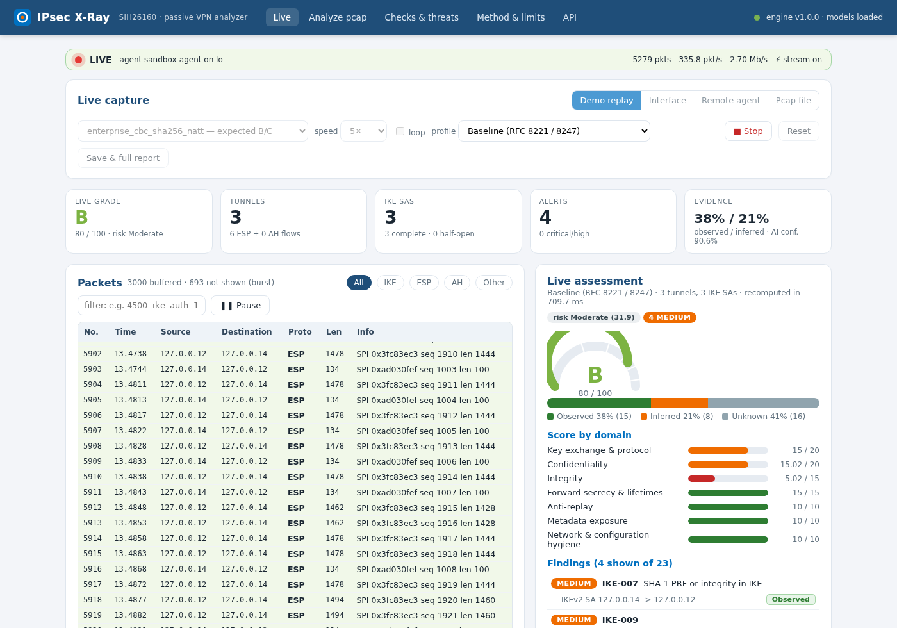
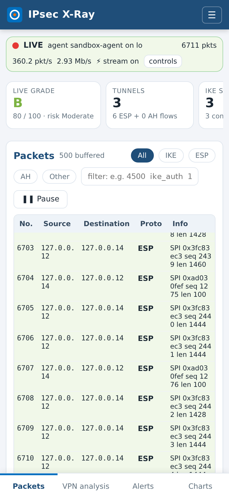
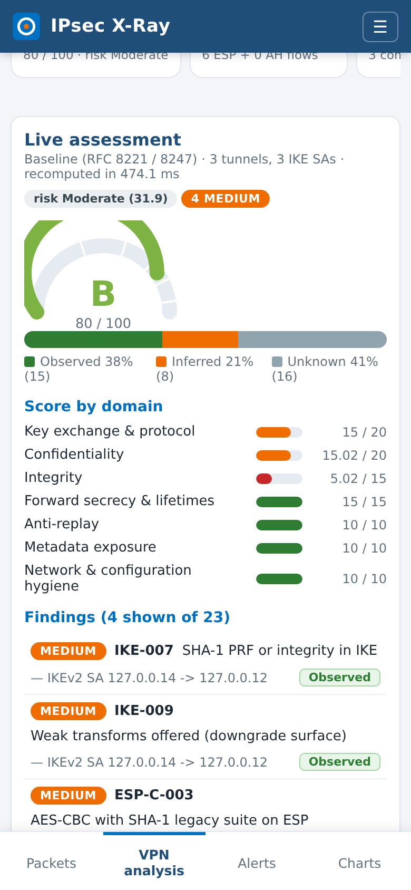
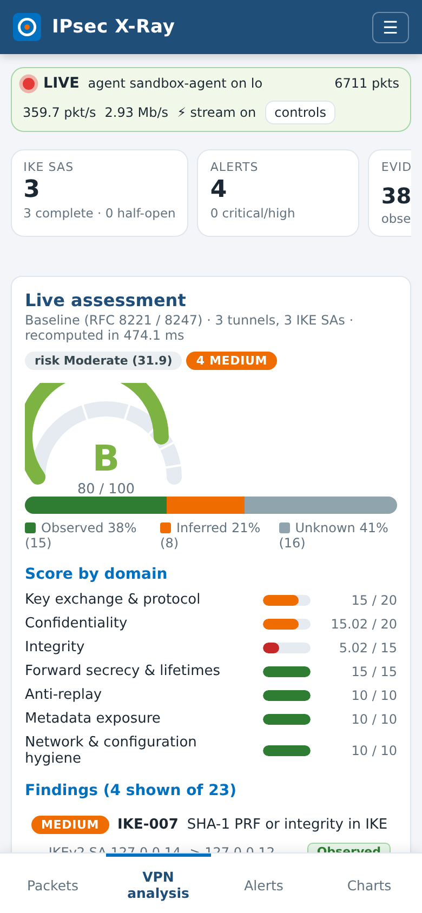
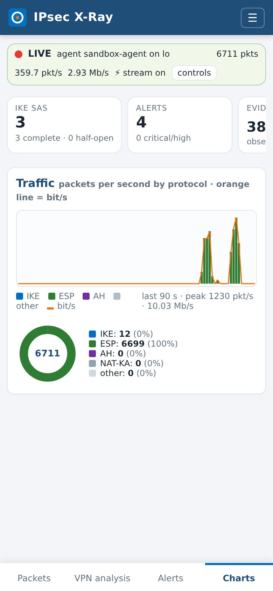

# IPsec X-Ray — AI-powered IPsec VPN protocol analyzer & security assessment framework

**SIH 2026 · Problem Statement SIH26160 (NTRO) · Team Sudo Spandr (ID 151087)**

IPsec X-Ray takes a packet capture of an IPsec VPN and, **without keys, decryption or any active probing**,
tells you what was negotiated, what is hidden inside the encrypted ESP stream, how secure the deployment is
against current standards, and what to fix first.

```
PCAP ─────────────────────┐
Live interface / agent ───┴► Parse (IKEv1/IKEv2/ESP/AH/NAT-T, IPv4/IPv6)
     ──► Infer hidden fields (ESP length physics + calibrated RandomForests)
     ──► Assess (66 checks · RFC 8221/8247/9395/9370 · NIST SP 800-77r1 · CNSA 2.0 · 4 profiles)
     ──► Score 0-100 + grade · risk score · 12-threat matrix · prioritised fixes
     ──► Dashboard (React PWA, phone-friendly) · **Live mode** (Wireshark-style packet view + rolling assessment)
     ──► REST API · WebSocket stream · CLI · executive & technical reports (HTML/PDF/JSON)
```

Every fact carries an **evidence tier**: **Observed** (read from cleartext fields), **Inferred** (derived from
side channels, with a confidence value that scales any penalty) or **Unknown** (not recoverable passively —
never penalised, but still accompanied by a recommendation).

---

## 1. Quick start

```bash
git clone https://github.com/sudonishant/sudo-spandr-c4i-sentinel.git sudo-spandr && cd sudo-spandr
./run.sh                      # venv + deps, trains models & generates samples if missing, builds the dashboard, serves :8000
# open http://localhost:8000      dashboard (Live tab first; open the same URL on a phone in the same network)
#      http://localhost:8000/docs OpenAPI
```

Other entry points:

```bash
./run.sh --test                                           # pytest suite (39 tests: ground truth, engine, API, reports, live mode)
python -m ipsec_xray.cli analyze capture.pcap --profile government --pdf report.pdf --json result.json
python -m ipsec_xray.cli batch ./pcaps --out reports --pdf # every pcap in a folder + summary.csv
python -m ipsec_xray.cli samples                          # list the bundled scenarios
python -m ipsec_xray.cli analyze samples/legacy_ikev1_aggressive_3des.pcap --fail-below   # CI gate: exit 2 if grade < B
python -m ipsec_xray.cli live --sample enterprise_cbc_sha256_natt --speed 5   # live mode in the terminal
sudo python -m ipsec_xray.live.agent --server http://SERVER:8000 --iface eth0  # stream a remote interface to the server
docker compose up --build                                 # containerised API + dashboard
```

Requirements: Python ≥ 3.10 (tested on 3.13), Node ≥ 18 only for building the dashboard (a prebuilt copy is
committed under `ipsec_xray/webui/`), 2 GB RAM.

---

## 1b. Live mode — real-time capture and assessment (new)

Open the dashboard: the first tab is **Live**. It is a deliberately *simple* Wireshark-like view — a colour-coded
packet list with filter/pause and a decoded detail pane — but instead of hundreds of dissectors it understands one
thing deeply: IPsec. While packets arrive it keeps a rolling protocol session, re-runs inference + all checks about
every 2 s and streams everything to every connected browser over a WebSocket:

* **Packets** — No./time/src/dst/proto/len/info rows for IKEv1, IKEv2, ESP, ESP-in-UDP, AH, NAT-keepalives and the
  cleartext traffic around them; IKEv1 aggressive mode and malformed messages are highlighted. Click a row for the
  decoded tree (IP → UDP → NAT-T → IKE header/payloads/proposals/notifies, or ESP/AH header with length residues)
  plus a hex dump. Text filter (`ike_auth`, `4500`, `10.0.0.1`, `!esp`) and All/IKE/ESP/AH/Other chips.
* **Live assessment** — grade/score gauge, risk level, per-domain bars and findings that update as evidence arrives
  (the grade can move when a rekey without PFS shows up, when a weak proposal is accepted, when replayed sequence
  numbers appear …). Same 66 checks and profiles as the offline analysis; switching profile re-scores in place.
* **Tunnels / IKE SAs** — per tunnel: mode, cipher framing (with the honest "AES-128 vs 256 not separable" note),
  integrity ICV size, traffic class inside, PFS, anti-replay state, rekeys; per IKE SA: version, algorithms, DH group,
  PQC hybrid, auth method, aggressive-mode / cleartext-ID / PSK flags.
* **Alerts** — one alert when a tunnel or IKE SA appears and one per newly detected critical/high/medium finding
  (with the fix); **Charts** — packets-per-second by protocol, bit/s line, protocol donut.
* **Save & full report** — writes everything captured so far to `data/captures/*.pcap`, runs the full offline
  pipeline and opens the normal result page (HTML/PDF/JSON reports). Live grade and offline grade agree.



<p>   </p>

### Sources

| Source | How | Needs |
|---|---|---|
| **Demo replay** | pick a bundled scenario, speed 0.5–60×; frames are re-timed to *now* but keep their real spacing, so timing features stay truthful at any speed | nothing |
| **Interface** | sniff an interface of the machine running the server | server started with `CAP_NET_RAW` (e.g. `sudo setcap cap_net_raw+eip $(readlink -f $(which python3))` or run as root); Npcap on Windows |
| **Remote agent** | `sudo python -m ipsec_xray.live.agent --server http://SERVER:8000 --iface eth0 --ipsec-only` on the box that sees the VPN traffic (gateway, mirror/SPAN port, tap); the agent forwards raw frames over `/ws/agent`, all analysis stays on the server | Python + scapy + websockets on the agent host; root/Npcap there |
| **Pcap file** | upload any `.pcap/.pcapng` and replay it live | nothing |

Phones and tablets: the UI is a responsive **PWA** (install from the browser menu — `manifest.webmanifest`, icons,
service worker for instant reload). A phone cannot sniff its own radio without root, so it is a *viewer*: run the
server on a laptop/Raspberry Pi/server and, if needed, an agent next to the VPN gateway. Everything else — packets,
grade, alerts — updates live on the phone.

Terminal-only environments: `python -m ipsec_xray.cli live --iface eth0` (or `--sample …`, `--pcap …`) prints the
same packet lines, alerts and rolling grade to the console.

**Demo of a genuine live capture without two VPN gateways:** the emitter re-addresses a scenario into 127.0.0.0/8
and transmits it on loopback with the original timing; the agent captures it like any real interface.

```bash
python -m uvicorn ipsec_xray.api.app:app --host 0.0.0.0 --port 8000        # 1. server (unprivileged)
sudo python -m ipsec_xray.live.agent --server http://localhost:8000 --iface lo --ipsec-only   # 2. capture agent
sudo python -m ipsec_xray.testbed.emit --sample legacy_ikev1_aggressive_3des --speed 2       # 3. traffic
```

(Without root the emitter falls back to UDP/4500 NAT-T datagrams between 127.0.0.x addresses — enough for an
IKE + ESP demo when only the capture side is privileged.)

---

## 2. What is in the box

| Layer | Path | Notes |
|---|---|---|
| Protocol decoders | `ipsec_xray/protocols/` | Byte-exact IKEv1 (main/aggressive/quick, SA attributes, vendor IDs, IDs) and IKEv2 (SA/KE/N/CERTREQ/SK sizes, ADDKE for RFC 9370 hybrids, notify catalogue), ESP, AH, NAT-T marker, IPv6, snaplen-truncated packets |
| Capture reader | `ipsec_xray/pcap/reader.py` | scapy-backed pcap/pcapng reader, IPv4/IPv6, fragments, keeps IP-header lengths so truncated captures still work |
| Session model | `ipsec_xray/analysis/session.py` | IKE SAs with exchange logs, ESP/AH flows, rekeys, sequence-number stats, payload-entropy samples, cleartext-beside-tunnel detection |
| Physics engine | `ipsec_xray/analysis/physics.py` | ESP length model `L = IV + ⌈(P+2)/B⌉·B + ICV`, Bayesian posterior over framing candidates from length residues, anchor packets (TCP ACK 52 B, ping 84 B, G.711 200 B) for IV+ICV overhead and tunnel/transport |
| ML | `ipsec_xray/ml/`, `models/` | Traffic simulator (VoIP, video, web, e-mail, chat, ICMP, file, SSH), 37 flow features, three calibrated RandomForests (traffic / cipher framing / mode). `--real DIR` mixes labelled real captures in |
| Inference | `ipsec_xray/analysis/inference.py` | Fuses physics × ML × entropy, PFS from rekey sizes, IKEv2 auth-method guess from IKE_AUTH sizes, leak meter, tiers + confidence |
| Assessment | `ipsec_xray/assessment/` | `checks.yaml` (66 checks, safe expression language), `threats.yaml` (12 threats), `profiles.yaml` (baseline / enterprise / government / pqc_ready), `engine.py` (scoring, grade caps, risk, threat matrix) |
| Reports | `ipsec_xray/report/` | Jinja2 HTML and ReportLab PDF, executive and technical variants |
| Live engine | `ipsec_xray/live/` | `sources.py` (interface capture with libpcap-style loopback de-duplication, timed pcap replay, agent ingest), `engine.py` (incremental `SessionBuilder` feed, bounded packet rows, per-second stats, 2-s snapshot = inference + assessment, alert diffing, packet detail decoder, pcap writer), `agent.py` (remote capture agent, binary WebSocket framing) |
| API | `ipsec_xray/api/` | FastAPI + SQLite result store, serves the SPA; `live.py` adds the live REST endpoints and the `/ws/live` (browser) and `/ws/agent` (capture agent) WebSockets |
| Dashboard | `frontend/` → `ipsec_xray/webui/` | React 18 + Vite PWA (manifest, service worker, icons), responsive down to 360 px with a bottom tab bar on phones, no chart libraries (inline SVG), hash routing |
| CLI | `ipsec_xray/cli.py` | analyze / batch / samples / serve / live / train / generate |
| Testbed | `ipsec_xray/testbed/`, `samples/` | Generator that writes eight physically-correct scenario captures with ground truth (`samples/manifest.json`); `emit.py` transmits any scenario on a real interface for live-capture demos |
| Real testbed | `testbed/strongswan/` | docker-compose lab (two strongSwan 6 gateways, hosts, tcpdump tap), 10 scenario config pairs, traffic generators, netns alternative |
| Tests | `tests/` | pytest: every scenario's inferred fields vs ground truth, engine invariants, API, reports |

---

## 3. REST API

| Method | Path | Purpose |
|---|---|---|
| GET | `/api/health` | engine version, model card |
| GET | `/api/profiles` · `/api/checks?profile=` · `/api/threats` | catalogues |
| GET | `/api/samples` · `/api/samples/{name}/download` | bundled scenarios with ground truth |
| POST | `/api/samples/{name}/analyze?profile=` | analyze a bundled scenario (adds `ground_truth`) |
| POST | `/api/analyze?profile=` (multipart `file`) | analyze an uploaded `.pcap/.pcapng` (≤ 200 MB) |
| GET | `/api/results` · `/api/results/{id}` | stored results |
| POST | `/api/results/{id}/reassess?profile=` | re-score the same facts under another profile |
| DELETE | `/api/results/{id}` | remove |
| GET | `/api/results/{id}/report.{html,pdf,json}?kind=technical\|executive` | reports |
| GET | `/api/live/sources` · `/api/live/status` · `/api/live/snapshot` · `/api/live/alerts` | live session: interfaces, samples, saved captures, connected agents; current status/stats; latest facts + assessment |
| POST | `/api/live/start` `{source: sample\|replay\|interface\|agent, sample, path, iface, speed, loop, profile}` · `/api/live/stop` · `/api/live/reset` · `/api/live/profile?profile=` | control |
| GET | `/api/live/packets?limit=` · `/api/live/packet/{n}` | packet rows; decoded tree + hex dump of one frame |
| POST | `/api/live/save?name=&analyze=true&profile=` · `/api/live/upload` (multipart) | save captured frames as pcap (+ full analysis → result id); upload a pcap for replay |
| WS | `/ws/live` | browser stream: `hello` (state), then batches of `packets`, `stats`, `snapshot`, `alert`, `status` events |
| WS | `/ws/agent?name=&iface=&profile=` | capture-agent ingest: binary messages of `struct '!dII'` (timestamp, linktype, length) + raw frame, several per message |

The result JSON has three parts: `facts` (capture, `ike[]`, `tunnels[]`, `summary` — every field with tier and
confidence), `assessment` (score, grade, `grade_cap`, `risk_score`, `domains`, `findings[]`, `check_results[]`,
`threats[]`, `top_actions[]`, `tiers`, `ai_confidence`) and `timing`.

---

## 4. Scoring model

Seven domains with caps that sum to 100: key exchange & protocol 20 · confidentiality 20 · integrity 15 ·
forward secrecy & lifetimes 15 · anti-replay 10 · metadata exposure 10 · network & configuration hygiene 10.
Penalties: critical 12 · high 8 · medium 5 · low 2 · info 0, multiplied by confidence for Inferred findings and
never applied to Unknown ones. Grades A+ ≥ 95, A ≥ 85, B ≥ 75, C ≥ 60, D ≥ 40, F < 40; any critical finding
caps the grade at D, any high at B. Risk score = severity-weighted, confidence-scaled exposure (0–100).
Threat likelihood rises with every linked failed check; impact is fixed per threat (5×5 matrix).

Profiles change severities: e.g. PSK is *info* under baseline, *high* under enterprise; MODP-2048 passes baseline
but fails government (CNSA 2.0 wants ≥ 3072/ECP-384); `pqc_ready` additionally requires an ML-KEM hybrid
(RFC 9370 ADDKE) and inherits everything from government.

---

## 5. Bundled scenarios (`python -m ipsec_xray.testbed.generate`)

| Scenario | Ground truth | Result (baseline) |
|---|---|---|
| good_ikev2_gcm_pqc_pfs | IKEv2 AES-256-GCM / ECP-384 + ML-KEM-1024, certs, PFS, VoIP | **A+ 100** |
| enterprise_cbc_sha256_natt | AES-CBC-256 + SHA2-256, MODP-2048, PSK, NAT-T, no PFS, web | **B 78** (enterprise profile: C) |
| legacy_ikev1_aggressive_3des | IKEv1 aggressive, XAUTH-PSK, 3DES/SHA1/MODP-1024, e-mail | **F 34** |
| terrible_ikev1_des_md5_null_esp | DES/MD5/MODP-768, ESP NULL encryption, ICMP + file | **F** |
| ipv6_natt_chacha_transport | IPv6, ChaCha20-Poly1305, X25519, transport mode, SSH + chat | **A+ 98** |
| ah_only_no_confidentiality | AH HMAC-SHA1-96 only, transport, ICMP (cleartext) | **D 79** (grade capped by critical ESP-I-004) |
| replay_flood_anomalies | replayed/decreasing ESP sequence numbers, IKE_SA_INIT flood + cookies, malformed IKE, snaplen 128 | **B 75** with SEQ/ANOM findings |
| hub_three_spokes_mixed_traffic | three tunnels (video, chat, file), one spoke on AES-CBC + SHA-1, no rekey → PFS Unknown | **B 78** |

`tests/test_inference.py` asserts, for every scenario, IKE version, cipher framing class, encapsulation mode,
traffic class, PFS state and the expected grade band.

---

## 6. Honest limits (what passive analysis cannot do)

* **Indistinguishable framings** — AES-128 vs AES-256, AES-GCM vs ChaCha20-Poly1305 vs AES-CCM, HMAC-SHA1-96 vs
  HMAC-MD5-96 produce identical on-wire lengths. X-Ray reports the framing class and lists every algorithm in it;
  the IKE proposal (when visible) narrows it further.
* **Encrypted IKEv2 exchanges** — IKE_AUTH and CREATE_CHILD_SA are encrypted: the Child-SA proposal, authentication
  method and USE_TRANSPORT_MODE are inferred from message sizes (with confidence) or reported Unknown.
* **Never on the wire** — ESN, anti-replay window size, configured lifetimes: Unknown, recommendation only.
* **PFS needs a rekey inside the capture.** Small ECDH groups cannot be separated from a long proposal list by
  size alone; the group *class* is reported instead.
* **ML is trained on simulated flows.** The traffic classifier's hold-out accuracy is on synthetic data and is
  optimistic; treat it as an indicator. Physics carries 60 % of the cipher/mode decision. Record real captures
  with `testbed/strongswan/capture.sh` and retrain with `python -m ipsec_xray.ml.train --real testbed/strongswan/pcaps`.
* **Live mode is bounded on purpose.** The browser keeps the last 3 000 packet rows and the server the last
  250 000 raw frames for "Save"; per-flow analysis windows are capped at 60 000 packets; when a burst exceeds what
  the UI can draw, the list shows "n not shown (burst)" while the analysis still sees every packet. Re-assessment
  cadence adapts to its own cost (about 0.1–0.7 s per snapshot for a handful of tunnels). Capturing needs raw-socket
  privilege on the capturing host — never on the phone or browser side.
* **Sandbox note** — the bundled captures are generated by `ipsec_xray/testbed/generate.py` (exact IKE/ESP/AH
  byte layouts, realistic timing) because kernel IPsec is unavailable where this repository was developed. The
  strongSwan lab under `testbed/strongswan/` produces real ones with no code changes.

---

## 7. Development

```bash
python -m pytest tests -q               # 39 tests (incl. live replay, WebSocket stream, agent ingest)
cd frontend && npm run dev              # Vite dev server on :5173 proxying /api to :8000
python -m ipsec_xray.ml.train --flows-per-class 300
python -m ipsec_xray.testbed.generate --out samples
```

Adding a check = one YAML block in `ipsec_xray/assessment/checks.yaml`:

```yaml
- id: IKE-099
  family: IKE
  title: Example
  scope: ike                      # ike | tunnel | capture
  when: "dh_bits < 112 and version == 2"
  severity: high
  severity_by_profile: {government: critical}
  domain: ke
  tier: "'Observed'"
  confidence: "1.0"
  ref: "RFC 8247 §2.4"
  threat: [TH-01]
  message: "DH group {dh} gives only {dh_bits}-bit security"
  fix: "Use MODP-3072 / ECP-384 or better."
```

Expressions are evaluated by a whitelisting AST evaluator (no attribute access on Python objects, no calls
except `len/min/max/any/all/round/abs/sum/str/int/float/sorted`).

---

## 8. References

RFC 4303 (ESP) · RFC 7296 (IKEv2) · RFC 8221 (ESP/AH algorithm requirements) · RFC 8247 (IKEv2 algorithm
requirements) · RFC 9395 (IKEv1 deprecation) · RFC 9370 (multiple key exchanges) · draft-ietf-ipsecme-ikev2-mlkem ·
NIST SP 800-77r1 · NSA CNSA 2.0 · Adrian et al. "Imperfect Forward Secrecy" (Logjam) · Felsch et al. USENIX 2018
(IKEv1 Bleichenbacher/PSK attacks) · Bhargavan & Leurent Sweet32 · ISCX VPN-nonVPN 2016 · ET-BERT (arXiv 2202.06335)
· strongSwan 6.0 (ML-KEM, IKE_INTERMEDIATE).

License: MIT (project code). Model weights and sample captures are generated artefacts and may be regenerated freely.
